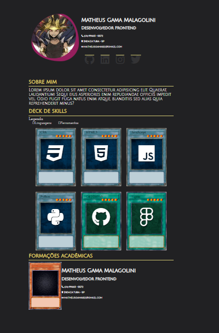
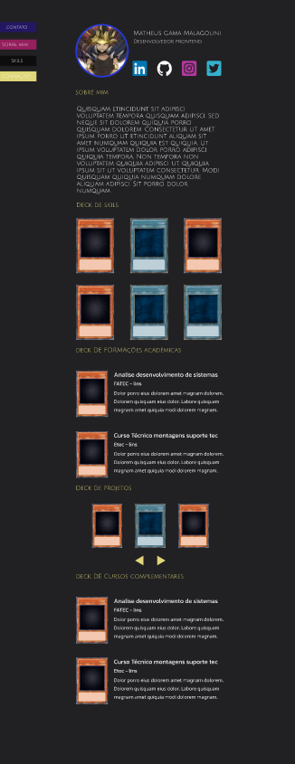
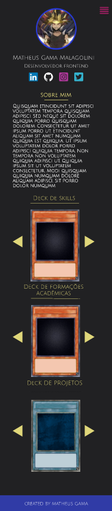

# Projeto-Portfolio-YU-GI-OH

- Designe Atual do projeto

## Infos

- :package: novas funcionalidades
- :up: atualizações 
- :ant: correção de bug
- :checkered_flag: release

## Learning

### Screenshot

- Visão desktop Desktop

- Visão desktop Mobile

## Author

- Website - [Matheus Gama](https://mth-gama.github.io/)
- GitHub - [@mth-gama](https://github.com/mth-gama)

## Acknowledgments

Projeto solo
